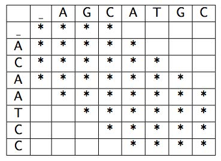
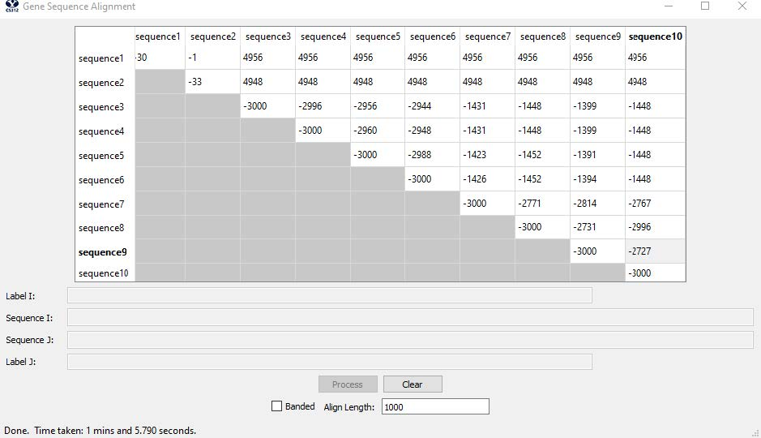
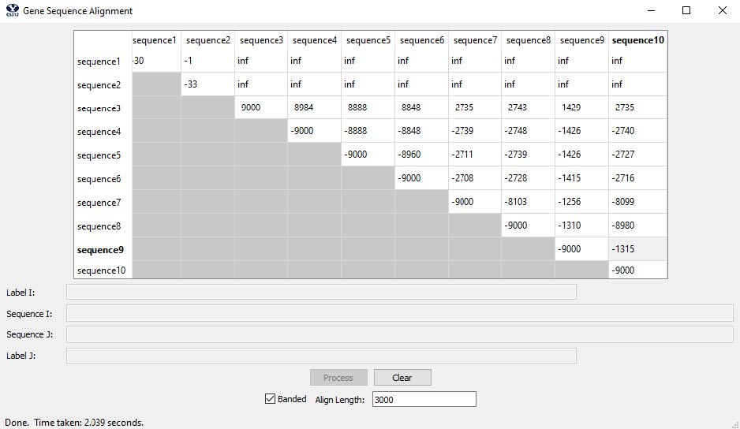
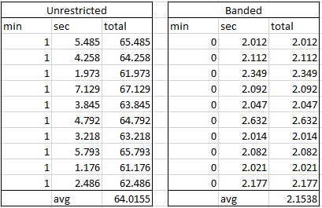

# Gene Sequencing

This projects is uses [dynamic programming](https://en.wikipedia.org/wiki/Dynamic_programming) to align dna sequences (both banded and unbanded).

To see the implementation, see [GeneSequencing.py](GeneSequencing.py).

## Results

For the full report (such as Big-O complexity and explanation), see [Report.pdf](Gene%20Sequencing%20-%20Report.pdf)

#### Sequences

#### Data

[Final genomes](genomes.txt)
